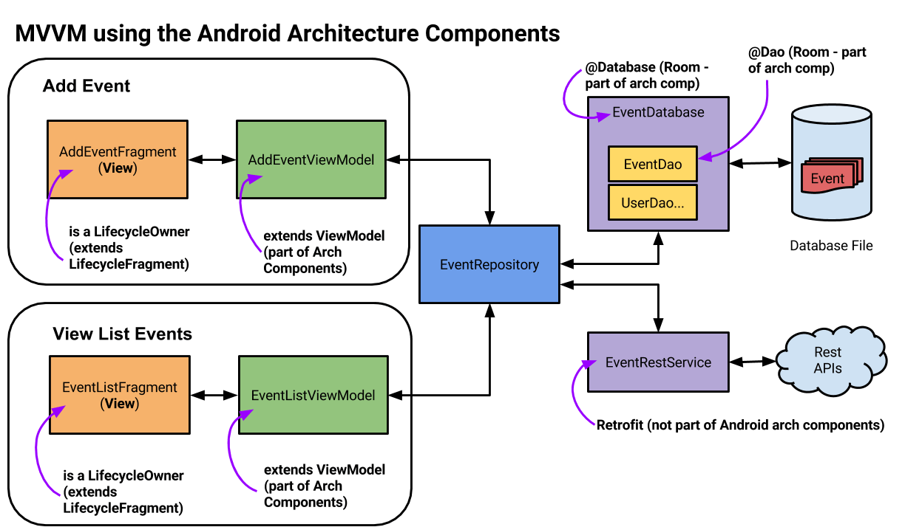
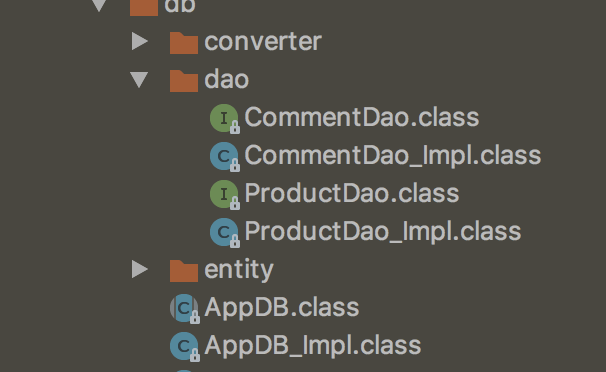

安卓开发技术发展到现在已经非常成熟，有很多的技术专项如插件，热修，加固，瘦身，性能优化，自动化测试等已经在业界有了完善的或者开源的解决方案。
作为一枚多年的安卓研发，有必要学习或了解下这些优秀的解决方案，领略那些行业*开创者*的思想魅力，然后转化为自己的技术技能，争取应用到日常的开发中去，提高自己研发水平。

<!--more-->

# Lifecycle+Retrofit+Room 云端漫步飞一般的感觉

安卓项目的开发结构，有原来最初的mvc，到后来有人提出的mvp，然后到mvvm的发展，无非就是依着*六大设计原则*的不断解耦，不断演变，使得项目的开发高度组件化，满足日常复杂多变的项目需求。

* 依赖倒置原则－Dependency Inversion Principle (DIP) 
* 里氏替换原则－Liskov Substitution Principle (LSP) 
* 接口分隔原则－Interface Segregation Principle (ISP) 
* 单一职责原则－Single Responsibility Principle (SRP) 
* 开闭原则－The Open-Closed Principle (OCP)

目前针对MVVM框架结构，[安卓官方](https://developer.android.google.cn/topic/libraries/architecture/adding-components.html)也给出了稳定的架构版本1.0。

本文也是围绕者官方思想，试着从*源码角度总结*学习经验，最后将这些控件二次封装，更加便于理解使用。其也会涉及到其他优秀的的库，如Gson,Glide,BaseRecyclerViewAdapterHelper等


## 一.起因
去年还在手机卫士团队做垃圾清理模块时候，赶上模块化二次代码重构技术需求，项目分为多个进程，其中后台进程负责从DB中获取数据（DB可云端更新升级），然后结合云端配置信息做相关逻辑操作，将数据回传到UI进程，UI进程中在后台线程中二次封装，最后post到主UI线程Update到界面展示给用户。

当时就和团队的同学沟通交流，面对这种数据多层次复杂的处理逻辑，设想可以做一种机制，将UI层的更新绑定到一个数据源，数据源数据的更新可以自动触发UI更新，实现与UI的解耦。
数据源控制着数据的来源，每种来源有着独立的逻辑分层，共享底层一些公共lib库。


后来想想，其实差不多就是MVVM思想，直到谷歌官方宣布[Android 架构组件 1.0 稳定版](https://mp.weixin.qq.com/s/9rC_5GhdAA_EMEbWKJT5vQ)的发布，才下决心学习下官方这一套思想，感受优秀的架构。

引用官方一张结构图如下：



## 二.各组件库原理及基本用法

这里主要探究下主要组件库的基本用法和原理，以理解其优秀思想为主。

### 谷歌官方Android Architecture Components

**Lifecycle+LiveData+ViewMode+Room** 

>A collection of libraries that help you design robust, testable, and maintainable apps. Start with classes for managing your UI component lifecycle and handling data persistence.

#### Lifecyle

一个安卓组件生命周期感知回调的控件，可以感知activity或fragment的生命周期变化，并回调相应接口。

可以先从源码抽象类分析，如下：

```
public abstract class Lifecycle {
    @MainThread
    public abstract void addObserver(@NonNull LifecycleObserver observer);

    @MainThread
    public abstract void removeObserver(@NonNull LifecycleObserver observer);

    @MainThread
    public abstract State getCurrentState();

    @SuppressWarnings("WeakerAccess")
    public enum Event {

        ON_CREATE,
 
        ON_START,

        ON_RESUME,

        ON_PAUSE,

        ON_STOP,

        ON_DESTROY,

        ON_ANY
    }

    @SuppressWarnings("WeakerAccess")
    public enum State {

        DESTROYED,
        INITIALIZED,
        CREATED,
        STARTED,
        RESUMED;

        public boolean isAtLeast(@NonNull State state) {
            return compareTo(state) >= 0;
        }
    }
}

/**
 * Marks a class as a LifecycleObserver. It does not have any methods, instead, relies on
 * {@link OnLifecycleEvent} annotated methods.
 * <p>
 * @see Lifecycle Lifecycle - for samples and usage patterns.
 */
@SuppressWarnings("WeakerAccess")
public interface LifecycleObserver {

}


```


*Lifecycle*抽象类有三个方法，可以添加、删除观察者,并且可以获取当前组件的生命周期的状态。
而*LifecycleObserver*接口只是个空接口做类型校验，具体事件交给了OnLifecycleEvent，通过注入回调相应事件。

二在最新的support V4包中，*Activity*和*Fragment*都实现了*LifecycleOwner*接口，意味着我们可以直接使用getLifecyle()获取当前*Activity*或*Fragment*的Lifecycle对象，很方便的添加我们的监听方法。

```
@SuppressWarnings({"WeakerAccess", "unused"})
public interface LifecycleOwner {

    @NonNull
    Lifecycle getLifecycle();
}
```

#### LiveData 
LiveData是一个持有范型类型的数据组件，将App生命组件与数据关联到一起，可以感知生命变更，规则回调数据变化。

```
public abstract class LiveData<T> {
	        private volatile Object mData = NOT_SET;//数据容器类

    //一个写死的处于Resume状态的LifecycleOwner，用于数据回调无限制情况
    private static final LifecycleOwner ALWAYS_ON = new LifecycleOwner() {

        private LifecycleRegistry mRegistry = init();

        private LifecycleRegistry init() {
            LifecycleRegistry registry = new LifecycleRegistry(this);
            registry.handleLifecycleEvent(Lifecycle.Event.ON_CREATE);
            registry.handleLifecycleEvent(Lifecycle.Event.ON_START);
            registry.handleLifecycleEvent(Lifecycle.Event.ON_RESUME);
            return registry;
        }

        @Override
        public Lifecycle getLifecycle() {
            return mRegistry;
        }
    };
    private SafeIterableMap<Observer<T>, LifecycleBoundObserver> mObservers =
            new SafeIterableMap<>();
   
    private void considerNotify(LifecycleBoundObserver observer) {
        if (!observer.active) {
            return;
        }

        if (!isActiveState(observer.owner.getLifecycle().getCurrentState())) {
            observer.activeStateChanged(false);
            return;
        }
        if (observer.lastVersion >= mVersion) {
            return;
        }
        observer.lastVersion = mVersion;
        //noinspection unchecked
        observer.observer.onChanged((T) mData);//最终的回调方法地方
    }

    private void dispatchingValue(@Nullable LifecycleBoundObserver initiator) {
        if (mDispatchingValue) {
            mDispatchInvalidated = true;
            return;
        }
        mDispatchingValue = true;
        do {
            mDispatchInvalidated = false;
            if (initiator != null) {
                considerNotify(initiator);
                initiator = null;
            } else {
                for (Iterator<Map.Entry<Observer<T>, LifecycleBoundObserver>> iterator =
                        mObservers.iteratorWithAdditions(); iterator.hasNext(); ) {
                    considerNotify(iterator.next().getValue());//可以添加做个监听者，这里遍历分发数据到每个监听者
                    if (mDispatchInvalidated) {
                        break;
                    }
                }
            }
        } while (mDispatchInvalidated);
        mDispatchingValue = false;
    }

    @MainThread
    public void observe(@NonNull LifecycleOwner owner, @NonNull Observer<T> observer) {
        if (owner.getLifecycle().getCurrentState() == DESTROYED) {
            // ignore
            return;
        }
        LifecycleBoundObserver wrapper = new LifecycleBoundObserver(owner, observer);
        LifecycleBoundObserver existing = mObservers.putIfAbsent(observer, wrapper);
        if (existing != null && existing.owner != wrapper.owner) {
            throw new IllegalArgumentException("Cannot add the same observer"
                    + " with different lifecycles");
        }
        if (existing != null) {
            return;
        }
        owner.getLifecycle().addObserver(wrapper);
    }

    @MainThread
    public void observeForever(@NonNull Observer<T> observer) {
        observe(ALWAYS_ON, observer);
    }

    @MainThread
    public void removeObserver(@NonNull final Observer<T> observer) {
        assertMainThread("removeObserver");
        LifecycleBoundObserver removed = mObservers.remove(observer);
        if (removed == null) {
            return;
        }
        removed.owner.getLifecycle().removeObserver(removed);
        removed.activeStateChanged(false);
    }

    //实现类回调方法
    protected void onActive() {

    }

    //实现类回调方法
    protected void onInactive() {

    }

    class LifecycleBoundObserver implements GenericLifecycleObserver {

        @Override
        public void onStateChanged(LifecycleOwner source, Lifecycle.Event event) {
            if (owner.getLifecycle().getCurrentState() == DESTROYED) {
                removeObserver(observer);
                return;
            }
            // immediately set active state, so we'd never dispatch anything to inactive
            // owner
            activeStateChanged(isActiveState(owner.getLifecycle().getCurrentState()));
        }

        void activeStateChanged(boolean newActive) {
            if (newActive == active) {
                return;
            }
            active = newActive;
            boolean wasInactive = LiveData.this.mActiveCount == 0;
            LiveData.this.mActiveCount += active ? 1 : -1;
            if (wasInactive && active) {
                onActive();
            }
            if (LiveData.this.mActiveCount == 0 && !active) {
                onInactive();
            }
            if (active) {//只有生命组件处于前台时，才触发数据的变更通知
                dispatchingValue(this);
            }
        }
    }

    static boolean isActiveState(State state) {
        return state.isAtLeast(STARTED);
    }
}

```

看源码，会发现LiveData有个重要的方法**observe(LifecycleOwner owner, Observer<T> observer)**, 在数据源数据有变更时，遍历分发数据到所有监听者，最后会回调onChanged()方法。


```
public interface Observer<T> {
    /**
     * Called when the data is changed.
     * @param t  The new data
     */
    void onChanged(@Nullable T t);
}
```

LiveData有两个实现类：*MediatorLiveData*和*MediatorLiveData*，继承关系如下：


*MutableLiveData*类只是暴露了两个方法：postData()和setData()。
*MediatorLiveData*类有个**addSource()**方法，可以实现监听另一个或多个LiveData数据源变化，这样我们就可以比较便捷且低耦合的实现多个数据源的逻辑，并且关联到一个MediatorLiveData上，实现多数据源的自动整合。

```
    @MainThread
    public <S> void addSource(@NonNull LiveData<S> source, @NonNull Observer<S> onChanged) {
        Source<S> e = new Source<>(source, onChanged);
        Source<?> existing = mSources.putIfAbsent(source, e);
        if (existing != null && existing.mObserver != onChanged) {
            throw new IllegalArgumentException(
                    "This source was already added with the different observer");
        }
        if (existing != null) {
            return;
        }
        if (hasActiveObservers()) {
            e.plug();
        }
    }
```

#### ViewModel

LiveData和LiveCycle将数据与数据，数据与UI生命绑定到了一起，实现了数据的自动管理和更新，那这些数据如何缓存呢？能否在多个页面共享这些数据呢？答案是ViewMode。

>A ViewModel is always created in association with a scope (an fragment or an activity) and will be retained as long as the scope is alive. E.g. if it is an Activity, until it is finished.

ViewMode相当于一层数据隔离层，将UI层的数据逻辑全部抽离干净，管理制底层数据的获取方式和逻辑。


```
         ViewModel   viewModel = ViewModelProviders.of(this).get(xxxModel.class);
         
         ViewModel   viewModel = ViewModelProviders.of(this, factory).get(xxxModel.class);
```

可以通过以上方式获取ViewModel实例，如果有自定义ViewModel构造器参数，需要借助**ViewModelProvider.NewInstanceFactory**，自己实现create方法。

那么，ViewMode是怎么被保存的呢？ 可以顺着ViewModelProviders源码进去看看。

```
    @NonNull
    @MainThread
    public <T extends ViewModel> T get(@NonNull String key, @NonNull Class<T> modelClass) {
        ViewModel viewModel = mViewModelStore.get(key);

        if (modelClass.isInstance(viewModel)) {
            //noinspection unchecked
            return (T) viewModel;
        } else {
            //noinspection StatementWithEmptyBody
            if (viewModel != null) {
                // TODO: log a warning.
            }
        }

        viewModel = mFactory.create(modelClass);
        mViewModelStore.put(key, viewModel);
        //noinspection unchecked
        return (T) viewModel;
    }
```

发现get方法会先从缓存中获取，没有的化就会通过*Factory*的create方法构造一个ViewModel，然后放入缓存，下次直接使用。

#### Room
Room是一种ORM（对象关系映射）模式数据库框架，对安卓SQlite的抽象封装，从此操作数据库提供了超便捷方式。

>The Room persistence library provides an abstraction layer over SQLite to allow fluent database access while harnessing the full power of SQLite.

同样基于ORM模式封装的数据库，比较有名还有*GreenDao*。而Room和其他ORM对比，具有编译时验证查询语句正常性，支持LiveData数据返回等优势。
我们选择room，更多是因为对LiveData的完美支持，可以动态的将DB数据变化自动更新到LiveData上，在通过LiveData自动刷新到UI上。

这里引用网络上的一张Room与其他同类性能对比图片：


*Room用法：*

* 1. 继承RoomDatabase的抽象类, 暴露抽象方法getxxxDao()。

```
@Database(entities = {EssayDayEntity.class, ZhihuItemEntity.class}, version = 1)
@TypeConverters(DateConverter.class)
public abstract class AppDB extends RoomDatabase {
    private static AppDB sInstance;

    @VisibleForTesting
    public static final String DATABASE_NAME = "canking.db";
    public abstract EssayDao essayDao();
 }
```

* 2. 获取db实例

```
ppDatabase db = Room.databaseBuilder(getApplicationContext(),
        AppDatabase.class, "database-name").build();
```

* 3. 实现Dao层逻辑

```
@Dao
public interface ZhuhuDao {
    @Query("SELECT * FROM zhuhulist  order by id desc, id limit 0,1")
    LiveData<ZhihuItemEntity> loadZhuhu();

    @Insert(onConflict = OnConflictStrategy.REPLACE)
    void insertItem(ZhihuItemEntity products);
}
```

* 4. 添加一张表结构

```
@Entity
public class User {
    @PrimaryKey
    private int uid;

    @ColumnInfo(name = "first_name")
    private String firstName;

    public String date;//默认columnInfo 为 date

}
```

就这么简单，就可以实现数据库的操作，完全隔离的底层复杂的数据库操作，大大节省项目研发重复劳动力。

从使用说明分析，UserDao和Db一个是接口，一个是抽象类，这些逻辑的实现完全是由annotationProcessor依赖注入帮我们实现的, annotationProcessor其实就是开源的android-apt的官方替代品。
那么编译项目后，可以在build目录下看到生成相应的类xxx_impl.class。


既然Room支持LiveData数据，那么有可以分析下源码,了解下具体原理，方便以后填坑。

先选Demo中Dao层的insert方法，看看数据如何加载到内存的。我们的query方法如下：

```
    @Insert(onConflict = OnConflictStrategy.REPLACE)
    void insertItem(ZhihuItemEntity products);
```

annotationProcessor帮我吗生成后的实现主要代码如下：

```
    private final RoomDatabase __db;
    private final EntityInsertionAdapter __insertionAdapterOfZhihuItemEntity;
    
    public ZhuhuDao_Impl(RoomDatabase __db) {
        this.__db = __db;
        //EntityInsertionAdapter类的匿名内部类实现方式，
        this.__insertionAdapterOfZhihuItemEntity = new EntityInsertionAdapter<ZhihuItemEntity>(__db) {
            public String createQuery() {
                return "INSERT OR REPLACE INTO `zhuhulist`(`id`,`date`,`stories`,`top_stories`) VALUES (nullif(?, 0),?,?,?)";
            }

            public void bind(SupportSQLiteStatement stmt, ZhihuItemEntity value) {
            	//通过SQLiteStatement的bind方法，可以很巧妙的将类对象数据转化为数据库要操作的数据类型。
                stmt.bindLong(1, (long)value.getId());//按顺序依次放入SQLiteStatement对象。
                if(value.date == null) {
                    stmt.bindNull(2);
                } else {
                    stmt.bindString(2, value.date);
                }

                //通过DB类注入的自定义转化器，我们可以将任何对象类型持久化到数据库中，并且很便捷的从数据库反序列化出来
                String _tmp = DateConverter.toZhihuStoriesEntity(value.stories);
                if(_tmp == null) {
                    stmt.bindNull(3);
                } else {
                    stmt.bindString(3, _tmp);
                }

                String _tmp_1 = DateConverter.toZhihuStoriesEntity(value.top_stories);
                if(_tmp_1 == null) {
                    stmt.bindNull(4);
                } else {
                    stmt.bindString(4, _tmp_1);
                }

            }
        };
    }

    
    public void insertItem(ZhihuItemEntity products) {
        this.__db.beginTransaction();

        try {
        	//借助SQLiteStatement类操作数据库，既优化了数据库操作性能，又巧妙的bind了对象类型数据。
            this.__insertionAdapterOfZhihuItemEntity.insert(products);
            this.__db.setTransactionSuccessful();
        } finally {
        	//这里很重要，我们平时操作数据库或流必须要做 finally块 关闭资源。
            this.__db.endTransaction();
        }
    }
```

实现类中可以看出insert是通过**EntityInsertionAdapter**类完成操作的，而EntityInsertionAdapter内部会持有个SupportSQLiteStatement，其实就是*SQLiteStatement*类的抽象封装。
其实例获取是通过RoomData内部方法compileStatement()得到的。

研究下RoomData抽象类源码：

```
public abstract class RoomDatabase {
    // set by the generated open helper.
    protected volatile SupportSQLiteDatabase mDatabase;//SQLiteDatabase类的封装抽象层
    private SupportSQLiteOpenHelper mOpenHelper;//SQLiteOpenHelper类的封装抽象层
    private final InvalidationTracker mInvalidationTracker;//绑定数据变更监听器，如在数据变化时通知LiveData
    
    protected abstract SupportSQLiteOpenHelper createOpenHelper(DatabaseConfiguration config);
    protected abstract InvalidationTracker createInvalidationTracker();
    
    public Cursor query(String query, @Nullable Object[] args) {
        return mOpenHelper.getWritableDatabase().query(new SimpleSQLiteQuery(query, args));
    }

    public Cursor query(SupportSQLiteQuery query) {
        assertNotMainThread();//每次数据库操作检查线程
        return mOpenHelper.getWritableDatabase().query(query);
    }


    public SupportSQLiteStatement compileStatement(String sql) {
        assertNotMainThread();
        return mOpenHelper.getWritableDatabase().compileStatement(sql);
    }

    public void beginTransaction() {
        assertNotMainThread();
        mInvalidationTracker.syncTriggers();
        mOpenHelper.getWritableDatabase().beginTransaction();
    }

    public void endTransaction() {
        mOpenHelper.getWritableDatabase().endTransaction();
        if (!inTransaction()) {
            // enqueue refresh only if we are NOT in a transaction. Otherwise, wait for the last
            // endTransaction call to do it.
            mInvalidationTracker.refreshVersionsAsync();
        }
    }
    
    public static class Builder<T extends RoomDatabase> {
        private MigrationContainer mMigrationContainer;//数据库升级辅助类

    @NonNull
        public Builder<T> addCallback(@NonNull Callback callback) {
            if (mCallbacks == null) {
                mCallbacks = new ArrayList<>();
            }
            mCallbacks.add(callback);
            return this;
        }
        
    @NonNull
        public T build() {
            //noinspection ConstantConditions
            if (mContext == null) {
                throw new IllegalArgumentException("Cannot provide null context for the database.");
            }
            //noinspection ConstantConditions
            if (mDatabaseClass == null) {
                throw new IllegalArgumentException("Must provide an abstract class that"
                        + " extends RoomDatabase");
            }
            if (mFactory == null) {
            //默认的SupportSQLiteOpenHelper创建工厂
                mFactory = new FrameworkSQLiteOpenHelperFactory();//SupportSQLiteOpenHelper的实现类，通过mDelegate带来类操作真正的SQLiteOpenHelper
            }
            DatabaseConfiguration configuration =
                    new DatabaseConfiguration(mContext, mName, mFactory, mMigrationContainer,
                            mCallbacks, mAllowMainThreadQueries, mRequireMigration);
            //最终通过反射加载系统帮我们实现的真正RoomData
            T db = Room.getGeneratedImplementation(mDatabaseClass, DB_IMPL_SUFFIX);
            db.init(configuration);
            return db;
        }
        
        public abstract static class Callback {

        public void onCreate(@NonNull SupportSQLiteDatabase db) {
        }

        public void onOpen(@NonNull SupportSQLiteDatabase db) {
        }
    }
    }
```

DB是通过Build设计模式获取实例的，在build过程中，可以添加CallBack抽象类回调数据的*onCreate*和*onOpen*。
这里发现个问题，抽象层封装那么深，*onUpgrade()*方法怎么回调呢？数据库的升级怎么添加自己的逻辑呢？奥秘在**MigrationContainer**类。


```
    public static class MigrationContainer {
        private SparseArrayCompat<SparseArrayCompat<Migration>> mMigrations =
                new SparseArrayCompat<>();

        public void addMigrations(Migration... migrations) {
            for (Migration migration : migrations) {
                addMigration(migration);
            }
        }

        private void addMigration(Migration migration) {
            final int start = migration.startVersion;
            final int end = migration.endVersion;
            SparseArrayCompat<Migration> targetMap = mMigrations.get(start);
            if (targetMap == null) {
                targetMap = new SparseArrayCompat<>();
                mMigrations.put(start, targetMap);
            }
            Migration existing = targetMap.get(end);
            if (existing != null) {
                Log.w(Room.LOG_TAG, "Overriding migration " + existing + " with " + migration);
            }
            targetMap.append(end, migration);
        }

        @SuppressWarnings("WeakerAccess")
        @Nullable
        public List<Migration> findMigrationPath(int start, int end) {
            if (start == end) {
                return Collections.emptyList();
            }
            boolean migrateUp = end > start;
            List<Migration> result = new ArrayList<>();
            return findUpMigrationPath(result, migrateUp, start, end);
        }
    }
    
    public abstract class Migration {
    	public final int startVersion;
		public final int endVersion;

    	public Migration(int startVersion, int endVersion) {
       	 this.startVersion = startVersion;
       	 this.endVersion = endVersion;
    	}

    	public abstract void migrate(@NonNull SupportSQLiteDatabase database);
    }
}
```

在Room.databaseBuilder过程中，可以通过*addMigration()*方法，设置多个或一个Migration。

在RoomOpenHelper的onUpgrade()方法中会依次调用升级范围内的Migration:

```
	@Override
    public void onUpgrade(SupportSQLiteDatabase db, int oldVersion, int newVersion) {
        boolean migrated = false;
        if (mConfiguration != null) {
            List<Migration> migrations = mConfiguration.migrationContainer.findMigrationPath(
                    oldVersion, newVersion);
            if (migrations != null) {
                for (Migration migration : migrations) {
                    migration.migrate(db);
                }
            }
        }
    }
```

分析Room到这里基本原理已了解，并且我们可以封装自己的Callback接口，对业务模块依次分发onCreate、onUpgrade方法，统一管理数据库的创建和升级。

### Retrofit

当前业界很流行，且很优秀的开源网络库，基于OkHttp之前开发。

>A type-safe HTTP client for Android and Java

个人理解Retrofit是高度抽象，且和业务耦合度很低的网络库，通过各种数据转化器或适配器，使得网络返回数据可以很奇妙的直接转化为我们想要的类型，与本地数据的缓存及持久化高度无缝对接，大大减少了开发投入。并且使得项目研发更易模块化和迭代升级。


基本用法可以移步[官网](http://square.github.io/retrofit/)学习研究，这里只分析下如何构造自定义返回类型，默认通用的请求返回如下：

```
	XXXService service = retrofit.create(XXXService.class);
	Call<List<Repo>> repos = service.listRepos("xxx");
```

```
 public <T> T create(final Class<T> service) {
    Utils.validateServiceInterface(service);
    if (validateEagerly) {
      eagerlyValidateMethods(service);
    }
    return (T) Proxy.newProxyInstance(service.getClassLoader(), new Class<?>[] { service },
        new InvocationHandler() {
          private final Platform platform = Platform.get();

          @Override public Object invoke(Object proxy, Method method, @Nullable Object[] args)
              throws Throwable {
            if (method.getDeclaringClass() == Object.class) {
              return method.invoke(this, args);
            }
            if (platform.isDefaultMethod(method)) {
              return platform.invokeDefaultMethod(method, service, proxy, args);
            }
            ServiceMethod<Object, Object> serviceMethod =
                (ServiceMethod<Object, Object>) loadServiceMethod(method);
            OkHttpCall<Object> okHttpCall = new OkHttpCall<>(serviceMethod, args);
            return serviceMethod.callAdapter.adapt(okHttpCall);
          }
        });
  }
```

retrofit.create方法内部通过java动态代理，链接接口方法，替换转化范型类型及返回类型。
Retrofit.Builder有两个重要方法，影响着*service.listRepos()*方法的返回值类型及反序类型。它们分别是：

```
    /** Add converter factory for serialization and deserialization of objects. */
    //影响者Call接口中的范型类型
    public Builder addConverterFactory(Converter.Factory factory) {
      converterFactories.add(checkNotNull(factory, "factory == null"));
      return this;
    }

    /**
     * Add a call adapter factory for supporting service method return types other than {@link
     * Call}.
     * 影响者Call接口的具体实现类型
     */
    public Builder addCallAdapterFactory(CallAdapter.Factory factory) {
      adapterFactories.add(checkNotNull(factory, "factory == null"));
      return this;
    }
```

通过addConverterFactory方法，可以将网络返回数据直接转化为本地的具体实体类型，并且retrofit已经为我们提供了常见协议数据类型的封装库，如下：


 Converter	 |  依赖
---------  | --------
 Gson	 |   com.squareup.retrofit2:converter-gson:xxx
 Jackson  |  	com.squareup.retrofit2:converter-jackson:xxx
 Moshi	 |  com.squareup.retrofit2:converter-moshi:xxx
 Protobuf  |  	com.squareup.retrofit2:converter-protobuf:xxx
 Wire	 |   com.squareup.retrofit2:converter-wire:xxx
 Simple XML	 |   com.squareup.retrofit2:converter-simplexml:xxx
 Scalars  |  	com.squareup.retrofit2:converter-scalars:xxx

Builder每添加一个转化器会保存在*List<Converter.Factory>*类型列表中去。通过以下代码转化为目标类型。

```
 	for (int i = start, count = converterFactories.size(); i < count; i++) {
      Converter.Factory factory = converterFactories.get(i);
      Converter<?, RequestBody> converter =
          factory.requestBodyConverter(type, parameterAnnotations, methodAnnotations, this);
      if (converter != null) {
        //noinspection unchecked
        return (Converter<T, RequestBody>) converter;
      }
    }
```

当然也可以自定义Converter类型：

```
public interface Converter<F, T> {
  T convert(F value) throws IOException;

  abstract class Factory {
    // 这里创建从ResponseBody其它类型的Converter，如果不能处理返回null
    // 主要用于对响应体的处理
    public Converter<ResponseBody, ?> responseBodyConverter(Type type, Annotation[] annotations,
    Retrofit retrofit) {
      return null;
    }

    // 在这里创建 从自定类型到ResponseBody 的Converter,不能处理就返回null，
    public Converter<?, RequestBody> requestBodyConverter(Type type,
    Annotation[] parameterAnnotations, Annotation[] methodAnnotations, Retrofit retrofit) {
    //在这里实现具体转化逻辑
    }

    // Retrfofit对于上面的几个注解默认使用的是调用toString方法
    public Converter<?, String> stringConverter(Type type, Annotation[] annotations,
    Retrofit retrofit) {
        //在这里实现具体转化逻辑
    }
  }
}
```

Retrofit通过*addCallAdapterFactory*方法可以支持返回类型*Java8*或*rxjava*的处理(也需要添加gradle依赖库)。

```
	new Retrofit.Builder()
      .addCallAdapterFactory(RxJavaCallAdapterFactory.create())
      .addCallAdapterFactory(RxJava2CallAdapterFactory.create()) 
      .build();
```

## 三. 封装、整合各框架到项目中去

主要是用LiveData将各框架的数据获取及页面更新，按照MVVM思想整合起来, 使得项目结构符合官方给出的架构图建议，搭建一层逻辑结构，使得更加方便的使用各个组件库。


从上到下的逻辑顺序，依次构建各个业务层 需要的逻辑控件：

### 1.编写需要数据初始化或更新UI的接口方法，并在Observer中更新。

```
	viewModel.getEssayData().observe(this, new Observer<Resource<ZhihuItemEntity>>() {
            @Override
            public void onChanged(@Nullable Resource<ZhihuItemEntity> essayDayEntityResource) {
            //数据源内数据变动后自动回调该接口，然后更新到UI上
                        updateUI(essayDayEntityResource.data);
            }
        });
```

### 2.构建UI层需要的ViewModel

```
public class EssayViewModel extends AndroidViewModel {
    private EssayRepository mRepository;
    private MediatorLiveData<Resource<ZhihuItemEntity>> mCache;

    public EssayViewModel(Application app) {
        super(app);
        mRepository = new EssayRepository(app);
    }

    public LiveData<Resource<ZhihuItemEntity>> getEssayData() {
        if (mCache == null) {
        //初始化后，从缓存读取
            mCache = mRepository.loadEssayData();
        }
        return mCache;
    }

    public void updateCache() {
        final LiveData<Resource<ZhihuItemEntity>> update = mRepository.update();
        mCache.addSource(update, new Observer<Resource<ZhihuItemEntity>>() {
            @Override
            public void onChanged(@Nullable Resource<ZhihuItemEntity> zhihuItemEntityResource) {
                mCache.setValue(zhihuItemEntityResource);
            }
        });

    }
    
    public void addMore(){
    	//TODO: 加载更多
    }
}
```
### 3.实现Repository类，管理数据获取渠道。


这里按照官方知道，写了个抽象的数据源类，每次先从本地DB取数据，然后获取网络数据更新到数据库，通过LiveData更新到UI层。
```
public abstract class AbsDataSource<ResultType, RequestType> {
    private final MediatorLiveData<Resource<ResultType>> result = new MediatorLiveData<>();

    @WorkerThread
    protected abstract void saveCallResult(@NonNull RequestType item);


    @MainThread
    protected abstract boolean shouldFetch(@Nullable ResultType data);

    // Called to get the cached getDate from the database
    @NonNull
    @MainThread
    protected abstract LiveData<ResultType> loadFromDb();

    @NonNull
    @MainThread
    protected abstract LiveData<IRequestApi<RequestType>> createCall();


    @MainThread
    protected abstract void onFetchFailed();


    @MainThread
    public AbsDataSource() {
        final LiveData<ResultType> dbSource = loadFromDb();
        result.setValue(Resource.loading(dbSource.getValue()));

        result.addSource(dbSource, new Observer<ResultType>() {
            @Override
            public void onChanged(@Nullable ResultType resultType) {
                result.removeSource(dbSource);
                if (shouldFetch(resultType)) {
                    fetchFromNetwork(dbSource);
                } else {
                    result.addSource(dbSource, new Observer<ResultType>() {
                        @Override
                        public void onChanged(@Nullable ResultType resultType) {
                            result.setValue(Resource.success(resultType));
                        }
                    });
                }
            }
        });
    }


    private void fetchFromNetwork(final LiveData<ResultType> dbSource) {
        final LiveData<IRequestApi<RequestType>> apiResponse = createCall();

        result.addSource(dbSource, new Observer<ResultType>() {
            @Override
            public void onChanged(@Nullable ResultType resultType) {
                result.setValue(Resource.loading(resultType));
            }
        });

        result.addSource(apiResponse, new Observer<IRequestApi<RequestType>>() {
            @Override
            public void onChanged(@Nullable final IRequestApi<RequestType> requestTypeRequestApi) {
                result.removeSource(apiResponse);
                result.removeSource(dbSource);
                //noinspection ConstantConditions
                if (requestTypeRequestApi.isSuccessful()) {
                    saveResultAndReInit(requestTypeRequestApi);
                } else {
                    onFetchFailed();

                    result.addSource(dbSource, new Observer<ResultType>() {
                        @Override
                        public void onChanged(@Nullable ResultType resultType) {
                            result.setValue(
                                    Resource.error(requestTypeRequestApi.getErrorMsg(), resultType));
                        }
                    });
                }
            }
        });

    }

    @MainThread
    private void saveResultAndReInit(final IRequestApi<RequestType> response) {
        new AsyncTask<Void, Void, Void>() {

            @Override
            protected Void doInBackground(Void... voids) {
                saveCallResult(response.getBody());
                return null;
            }

            @Override
            protected void onPostExecute(Void aVoid) {
                // we specially request a new live getDate,
                // otherwise we will get immediately last cached value,
                // which may not be updated with latest results received from network.

                result.addSource(loadFromDb(), new Observer<ResultType>() {
                    @Override
                    public void onChanged(@Nullable ResultType resultType) {
                        result.setValue(Resource.success(resultType));
                    }
                });
            }
        }.execute();
    }

    public final MediatorLiveData<Resource<ResultType>> getAsLiveData() {
        return result;
    }
}


```

### 4.封装Room数据库使用辅助类


这里二次封装了数据库回调接口，便于多个逻辑模块多数据库的统一管理使用。

```
public abstract class AbsDbCallback {
    public abstract void create(SupportSQLiteDatabase db);

    public abstract void open();

    public abstract void upgrade(SupportSQLiteDatabase db, int oldVersion, int newVersion);
}

public class DbCallbackHelper {
    private static ArrayList<AbsDbCallback> mDbCallbacks = new ArrayList<>();

    public static void init() {
        mDbCallbacks.add(new EssayDbCallback());
    }

    public static void dispatchOnCreate(SupportSQLiteDatabase db) {
        for (AbsDbCallback callback : mDbCallbacks) {
        //分发onCreate接口
            callback.create(db);
        }
    }

    private static void dispatchUpgrade(SupportSQLiteDatabase db, int oldVersion, int newVersion) {
        for (AbsDbCallback callback : mDbCallbacks) {
            callback.upgrade(db, oldVersion, newVersion);
        }
    }

    public static Migration[] getUpdateConfig() {
    	//每次数据库升级配置这里就可以自动分发到各业务模块的onUpgrade()方法
        return new Migration[]{
                new Migration(1, 2) {

                    @Override
                    public void migrate(@NonNull SupportSQLiteDatabase database) {
                        dispatchUpgrade(database, 1, 2);
                    }
                },
                new Migration(2, 3) {

                    @Override
                    public void migrate(@NonNull SupportSQLiteDatabase database) {
                        dispatchUpgrade(database, 2, 3);
                    }
                }
        };
    }
}

```

### 5.对网络库数据处理的二次封装

定义一个范型的数据返回接口，便于抽象业务构造及替换网络请求方式。

```
public interface IRequestApi<ResultType> {
    ResultType getBody();
    String getErrorMsg();
    boolean isSuccessful();
}


	@WorkerThread
    public <ResultType> LiveData<IRequestApi<ResultType>> getEssay(@EssayWebService.EssayType String type) throws IOException {
        EssayWebService api = mRetrofit.create(EssayWebService.class);

        Call<ZhihuItemEntity> essayCall = api.getZhihuList("latest");
        MediatorLiveData<IRequestApi<ResultType>> result = new MediatorLiveData<>();
        final Response<ZhihuItemEntity> response = essayCall.execute();

        IRequestApi<ResultType> requestApi = new IRequestApi<ResultType>() {
            @Override
            public ResultType getBody() {
                ZhihuItemEntity entity = response.body();
                return (ResultType) entity;
            }

            @Override
            public String getErrorMsg() {
                return response.message();
            }

            @Override
            public boolean isSuccessful() {
                return response.isSuccessful();
            }
        };
        result.postValue(requestApi);


        return result;
    }

```

定义一个*Resource<T>*的类型包装统一的传递数据，便于UI业务的统一处理。

```
public class Resource<T> {
    public enum Status {
        LOADING, MORE_ADD, SUCCEED, ERROR
    }

    @NonNull
    public final Status status;
    @Nullable
    public final T data;
    @Nullable
    public final String message;

    private Resource(@NonNull Status status, @Nullable T data, @Nullable String message) {
        this.status = status;
        this.data = data;
        this.message = message;
    }

    public static <T> Resource<T> success(@NonNull T data) {
        return new Resource<>(SUCCEED, data, null);
    }

    public static <T> Resource<T> error(String msg, @Nullable T data) {
        return new Resource<>(ERROR, data, msg);
    }

    public static <T> Resource<T> loading(@Nullable T data) {
        return new Resource<>(LOADING, data, null);
    }

    public static <T> Resource<T> moreSucceed(@Nullable T data) {
        return new Resource<>(MORE_ADD, data, null);
    }
}
```

---
以上二次封装Demo源码已上传[GitHub](https://github.com/CankingApp/mvvmArch.git), 有兴趣同学可以学习交流及Star。


## 四. 总结

回顾官方的这一套框架结构，其中LivaData个人觉得最重要，她将数据与数据、数据与UI链接在一起，起到了数据的自动管理，解耦多个业务逻辑，是一种优秀的编程思想。

但是LiveData是否是最适合用到android架构开发中取呢？官方给出了这样一句话：
>Note: If you are already using a library like RxJava or Agera, you can continue using them instead of LiveData. But when you use them or other approaches, make sure you are handling the lifecycle properly such that your data streams pause when the related LifecycleOwner is stopped and the streams are destroyed when the LifecycleOwner is destroyed. You can also add the android.arch.lifecycle:reactivestreams artifact to use LiveData with another reactive streams library (for example, RxJava2).

同样官方没有忽略RxJava的优秀，但是由于个人对RxJava的认识只是查看网络资料了解，并未领略到其威力，有兴趣同学可以了解下。
>RxJava就是一种用Java语言实现的响应式编程，来创建基于事件的异步程序

优秀的框架重在学习其独特的思想，了解其基本实现原理，然后转化为自己的编程思想。个人觉的这个过程是很缓慢的，只有不断的感悟不同的优秀框架，慢慢的才能产生质变。


------
欢迎转载，请标明出处：常兴E站 [canking.win](http://www.canking.win)


